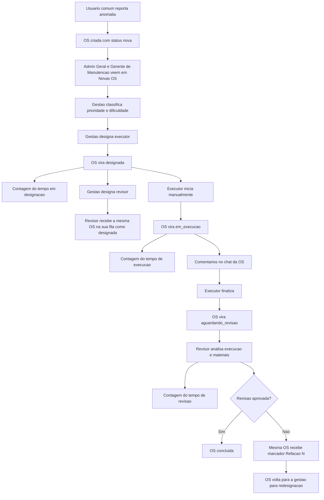

# Fluxo Corrigido de O.S. e Reports

## Objetivo

Este documento consolida o fluxo ideal de abertura, designação, execução, revisão, mensagens e refação das Ordens de Serviço (O.S.) do HotGest, com base no estudo do projeto atual, no POP operacional e nas decisões de negócio já validadas.

Ele deve ser tratado como a referência funcional para as próximas correções e implementações.

## Perfis e permissões

### Usuários comuns

- Recepção
- Camareira
- Controlador

Permissões:

- Podem abrir reports de anomalia.
- Não classificam prioridade.
- Não classificam dificuldade.
- Não designam executor.
- Não designam revisor.
- Não acompanham operação por fila própria.
- Não participam do histórico operacional da O.S. após a abertura do report.

### Gestão

- Admin Geral
- Gerente de Manutenção

Permissões:

- Recebem novas O.S. na coluna de novas O.S.
- Classificam prioridade e dificuldade.
- Designam executor.
- Designam revisor.
- Podem reavaliar prioridade, dificuldade e contexto com base nos comentários da O.S.
- Em caso de refação, redesignam a mesma O.S., agora marcada com `Refação #N`.

### Execução

- Executores

Permissões:

- Recebem O.S. designadas para execução.
- Iniciam a execução manualmente.
- Comentam no chat da O.S.
- Finalizam a execução.
- Podem atuar como revisores, desde que não revisem a própria execução.

### Revisão

Quem pode revisar:

- Gerente de Manutenção
- Executores

Regra obrigatória:

- O revisor nunca pode ser a mesma pessoa que executou a O.S.

## Princípios do fluxo

- Toda anomalia começa como uma única O.S.
- O registro da O.S. é conjunto e contínuo.
- Executor e revisor ficam anexados ao mesmo registro principal.
- O histórico da O.S. deve concentrar comentários, decisões, mudanças de prioridade, revisão e fechamento.
- Em caso de reprovação, a mesma O.S. é reaproveitada e passa a carregar o marcador de refação.
- Cada nova reprovação incrementa o contador de refações da mesma O.S.
- O chat é por O.S., não uma inbox solta entre usuários.

## Fluxo ideal

### 1. Abertura do report

Origem típica:

- Recepção
- Camareira
- Controlador

Comportamento:

- O usuário informa a anomalia.
- O sistema cria uma O.S. com status inicial `nova`.
- A O.S. aparece na coluna de novas O.S. para:
  - Admin Geral
  - Gerente de Manutenção

Regras:

- A prioridade inicial não é definida pelo usuário comum.
- A prioridade e a dificuldade são classificadas pela gestão.
- Após abrir o report, o usuário comum não participa do histórico operacional da O.S.

### 2. Triagem e designação do executor

Responsáveis:

- Admin Geral
- Gerente de Manutenção

Comportamento:

- Um dos dois classifica a O.S.
- Um dos dois designa o executor.
- Ao ser designada, a O.S. muda de `nova` para `designada`.
- O sistema passa a contar o tempo entre a designação e o início real da execução.

Regra crítica:

- `designada` não significa `em execução`.
- A execução só começa quando o executor inicia manualmente a tarefa.
- O tempo em `designada` precisa ser auditável.

### 3. Início da execução

Responsável:

- Executor designado

Comportamento:

- O executor visualiza a O.S. na sua fila.
- Ao iniciar, a O.S. muda de `designada` para `em_execucao`.
- O cronômetro e os indicadores de SLA começam aqui.

### 4. Comentários e reavaliação durante a execução

Participantes no histórico da O.S.:

- Executor
- Revisor
- Admin Geral
- Gerente de Manutenção

Comportamento:

- O executor pode registrar comentários operacionais.
- A gestão pode responder e atualizar a condução da tarefa.
- O revisor pode registrar comentários dentro da etapa de revisão.

Regras:

- O histórico de mensagens é da O.S., não da caixa de entrada geral.
- A gestão pode reavaliar:
  - prioridade
  - dificuldade
  - orientação operacional

### 5. Encerramento da execução e envio para revisão

Responsável:

- Executor

Comportamento:

- Ao finalizar a execução, a O.S. vai para `aguardando_revisao`.
- O executor informa os materiais utilizados.
- O consumo informado fica pendente de conferência dentro do mesmo registro da O.S.
- O sistema deve registrar o tempo total de execução.

Regra:

- Tarefa de revisão não consome material.
- A revisão confere também os materiais usados na execução.

### 6. Designação do revisor

Responsáveis:

- Admin Geral
- Gerente de Manutenção

Quem pode ser revisor:

- Gerente de Manutenção
- Executores

Restrições:

- O revisor não pode ser o mesmo executor da O.S.

Comportamento:

- Após a designação do executor, a gestão também deve designar um revisor.
- O revisor recebe um card da mesma O.S. na sua visão operacional.
- Esse card aparece para o revisor na coluna `designada`.
- O sistema mantém, para fins analíticos, o tempo entre a designação e o início da execução.

Regra estrutural:

- Não nasce uma segunda O.S. de revisão como registro principal separado.
- A revisão pertence à mesma O.S.
- O sistema apenas anexa o revisor ao registro principal e libera a etapa de revisão para ele.

### 7. Revisão

Responsável:

- Revisor designado

Comportamento:

- O revisor acessa a mesma O.S.
- Ele valida:
  - qualidade da execução
  - conformidade da entrega
  - coerência dos materiais utilizados

Possíveis resultados:

- `aprovada`
- `reprovada`

Regra de tempo:

- O sistema deve registrar o tempo total de revisão.

### 8. Aprovação da revisão

Comportamento:

- Se a revisão for aprovada, a mesma O.S. é encerrada.
- O registro final da O.S. mantém:
  - solicitante
  - executor
  - revisor
  - comentários
  - materiais
  - decisões da gestão

Status final:

- `concluida`

### 9. Reprovação e refação

Comportamento:

- Se a revisão reprovar a execução, a mesma O.S. é reaproveitada.
- A O.S. recebe o marcador `Refação #N`, em que `N` representa a quantidade de refações já ocorridas.
- A mesma O.S. volta para a gestão como novo card operacional para redesignação.

Regras de refação:

- A refação não cria uma nova O.S. principal.
- A rastreabilidade da refação deve ficar no mesmo registro.
- O card volta para o fluxo operacional com a nova característica de refação.
- O dado de refação é relevante e deve ser auditável.
- A O.S. reaproveitada entra novamente no ciclo:
  - nova
  - designada
  - em execução
  - aguardando revisão
  - concluída ou nova refação

## Estados oficiais da O.S.

### Fluxo principal

- `nova`
- `designada`
- `em_execucao`
- `aguardando_revisao`
- `concluida`

Observação:

- A refação não precisa duplicar os status operacionais.
- A mesma O.S. reutiliza os mesmos estados.
- A refação deve ser representada por atributos adicionais, como:
  - `refacao_numero`
  - `motivo_refacao`
  - `revisao_reprovada_em`
  - `voltou_para_redesignacao`

## Regras de mensageria

### Modelo correto

- Toda mensagem pertence a uma O.S.
- O histórico é único por O.S.
- O histórico deve permanecer visível ao longo de toda a vida da O.S.

### Quem pode comentar

- Executor
- Revisor
- Admin Geral
- Gerente de Manutenção

### Função prática do chat da O.S.

- Comentários de contexto
- Atualizações de execução
- Solicitações da gestão
- Reclassificação de prioridade ou dificuldade
- Registro da decisão de aprovação ou reprovação

### Modelo incorreto

- Inbox genérica sem vínculo com O.S.
- Mensagem solta que não compõe o histórico do chamado

## Regras de materiais

- O executor informa os materiais usados ao concluir a execução.
- O revisor não consome material.
- O revisor revisa os materiais informados pelo executor.
- O consumo precisa permanecer associado à mesma O.S.
- O fechamento definitivo deve considerar a execução e a revisão.

## Regras de interface por perfil

### Recepção, camareira e controlador

- Tela simples de report.
- Sem definição de prioridade real.
- Sem acompanhamento operacional detalhado.
- Sem participação no chat e no histórico operacional da O.S.

### Gestão

Kanban com pelo menos as colunas:

- Novas O.S.
- Designadas
- Em execução
- Aguardando revisão
- Concluídas

### Executor

Fila pessoal com:

- O.S. designadas
- O.S. em execução
- O.S. devolvidas se houver refação designada para ele

### Revisor

Fila operacional com as O.S. onde ele foi definido como revisor.

Regra:

- O card do revisor entra como `designada` para ele.
- Não é necessária uma fila separada chamada "minhas revisões" para gestor.

## Diagrama resumido do fluxo

## Modelo de dados mínimo recomendado

### O.S.

- `id`
- `status`
- `titulo`
- `descricao`
- `local`
- `prioridade`
- `dificuldade`
- `criado_por`
- `executor_id`
- `revisor_id`
- `designado_em`
- `iniciado_em`
- `finalizado_execucao_em`
- `tempo_ate_inicio_execucao`
- `tempo_execucao`
- `revisao_iniciada_em`
- `revisado_em`
- `tempo_revisao`
- `resultado_revisao`
- `refacao_numero`
- `motivo_refacao`
- `revisao_reprovada_em`
- `voltou_para_redesignacao`
- `created_at`
- `updated_at`

### Comentários da O.S.

- `id`
- `os_id`
- `autor_id`
- `tipo_autor`
- `mensagem`
- `created_at`

### Materiais da O.S.

- `id`
- `os_id`
- `item_estoque_id`
- `quantidade`
- `informado_por_executor`
- `validado_na_revisao`

## Divergências do mock atual em relação ao fluxo correto

- Hoje a O.S. sai de `nova` direto para `in_progress`.
- Hoje a revisão cria um novo ticket separado para revisão.
- Hoje só o gerente de manutenção consegue designar revisor.
- Hoje o chat da O.S. é apenas visual e não persistente.
- Hoje as mensagens são soltas e não vinculadas a uma O.S.
- Hoje não existe status `designada`.
- Hoje não existe status `aguardando_revisao`.
- Hoje a refação não é tratada como a mesma O.S. com contador de refações.
- Hoje não existe medição do tempo entre designação e início da execução.
- Hoje não existe medição dedicada do tempo de execução e do tempo de revisão.
- Hoje o revisor pode coincidir com o executor se nada bloquear isso.

## Decisão funcional final

O fluxo correto do HotGest deve funcionar assim:

1. Um usuário comum reporta uma anomalia.
2. A O.S. nasce como `nova`.
3. Admin Geral e Gerente de Manutenção recebem essa O.S. em novas O.S.
4. Um deles classifica a tarefa e designa o executor.
5. A O.S. vira `designada`.
6. Um deles designa também o revisor, obrigatoriamente diferente do executor.
7. O executor inicia a tarefa manualmente, e só então a O.S. vira `em_execucao`.
8. O sistema mede o tempo entre a designação e o início real da execução.
9. Toda comunicação operacional fica registrada no chat da própria O.S., restrita a executor, revisor e gestão.
10. Ao finalizar, a O.S. vira `aguardando_revisao`.
11. O sistema registra o tempo total de execução.
12. O revisor valida a execução e os materiais no mesmo registro da O.S.
13. O sistema registra o tempo total de revisão.
14. Se aprovada, a O.S. é concluída.
15. Se reprovada, a mesma O.S. volta para a gestão com marcador de `Refação #N`, para redesignação e nova rodada operacional.
